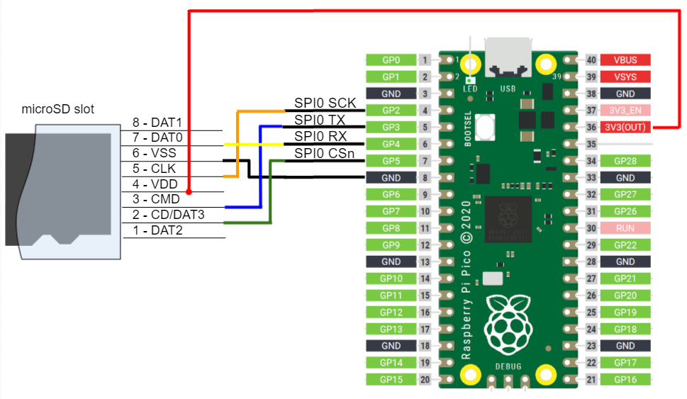
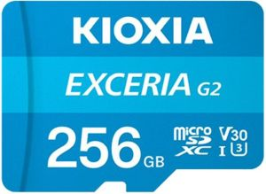

# Hi-Res WAV player for Raspberry Pi Pico


## Overview
RPi_Pico_WAV_Player is Hi-Res WAV player for Raspberry Pi Pico.

This project features:
* Playback up to Hi-Res WAV format
  * Channel: Mono, Stereo
  * Bit resolution: 16bit, 24bit
  * Sampling frequency: 44.1KHz, 88.2KHz, 96KHz, 176.4KHz, 192KHz
* SD Card interface (exFAT supported)
* 160x80 LCD display
* UI Control by 3 GPIO buttons or Headphone Remote Control Buttons
* Display Tag information by LIST chunk in WAV File
* Display Coverart image by JPEG file
* Volume Control Function by fully utilizing 32bit DAC range

## Supported Board and Peripheral Devices
* Raspberry Pi Pico
* ST7735S 0.96" 160x80 LCD
* PCM5102 32bit I2S Audio DAC

## Pin Assignment & Connection
### PCM5102
| Pico Pin # | GPIO | Function | Connection |
----|----|----|----
| 21 | GP16 | BCK | to PCM5102 BCK (13) |
| 22 | GP17 | LRCK | to PCM5102 LRCK (15) |
| 23 | GND | GND | GND |
| 24 | GP18 | SDO | to PCM5102 DIN (14) |
| 32 | GP27 | AUDIO_DAC_ENABLE | to PCM5102 XSMT (17) |
| 36 / 40 | 3V3(OUT) / VBUS | VCC | to VIN of PCM5102 board |

From DAC noise's point of view, it is recommended to provide the power of PCM5102 from VBUS (5V).
For battery operation, use 3V3(OUT) pin as described in schematic.


#### PCM5102 Board Setting
* tie PCM5102 SCK (12) to low (bridge short land)
* H1L (FLT) = L
* H2L (DEMP) = L
* H3L (XSMT): Remove the bridge to H and connect GP27
* H4L (FMT) = L


### ST7735S LCD driver
| Pico Pin # | GPIO | Function | Connection |
----|----|----|----
| 12 | GP9 | GPIO | BLK |
| 14 | GP10 | SPI1_SCK | SCL |
| 15 | GP11 | SPI1_TX | SDA |
| 17 | GP13 | SPI1_CSn | CS |
| 18 | GND | GND | GND |
| 19 | GP14 | GPIO | DC |
| 20 | GP15 | GPIO | RES |
| 36 | 3V3(OUT) | 3.3V | VCC |


### SD Card interface
| Pico Pin # | GPIO | Function | Connection |
----|----|----|----
|  4 | GP2 | SPI0_SCK | CLK (5) |
|  5 | GP3 | SPI0_TX | CMD (3) |
|  6 | GP4 | SPI0_RX | DAT0 (7) |
|  7 | GP5 | SPI0_CSn | CD/DAT3 (2) |
|  8 | GND | GND | VSS (6) |
| 36 | 3V3(OUT) | 3.3V | VDD (4) |

#### Caution
* Wire length between Pico and SD card is very sensitive. Short wiring as possible is desired, otherwise access errors  will occur.



### Control Switches
At least either of GPIO Push Buttons or Headphone Remote Control Buttons need to be implemented.

| Pico Pin # | GPIO | Function | Connection |
----|----|----|----
| 26 | GP20 | GPIO | Push Button (Minus) |
| 29 | GP22 | GPIO | Push Button (Plus) |
| 31 | GP26 | ADC0 | Headphone Remote Control (MIC pin) and/or Push Button (Center)|

* 2.2Kohm pullup resister is mandatory for both cases.


## Schematic
Additional power control circuit and battery voltage monitoring circuit are described in schematic for battery operation.

[RPi_Pico_WAV_Player_schematic.pdf](doc/RPi_Pico_WAV_Player_schematic.pdf)

## How to build
* See ["Getting started with Raspberry Pi Pico"](https://datasheets.raspberrypi.org/pico/getting-started-with-pico.pdf)
* Put "pico-sdk", "pico-examples" and "pico-extras" on the same level with this project folder.
* Set environmental variables for PICO_SDK_PATH, PICO_EXTRAS_PATH
* Build is confirmed in Developer Command Prompt for VS 2022 and Visual Studio Code on Windows enviroment
* Confirmed with Pico SDK 1.5.1, cmake-3.27.2-windows-x86_64 and gcc-arm-none-eabi-10.3-2021.10-win32
```
> git clone -b 1.5.1 https://github.com/raspberrypi/pico-sdk.git
> cd pico-sdk
> git submodule update -i
> cd ..
> git clone -b sdk-1.5.1 https://github.com/raspberrypi/pico-examples.git
>
> git clone -b sdk-1.5.1 https://github.com/raspberrypi/pico-extras.git
> 
> git clone -b main https://github.com/elehobica/RPi_Pico_WAV_Player.git
> cd RPi_Pico_WAV_Player
> git submodule update -i
> cd ..
```
* Lanuch "Developer Command Prompt for VS 2022"
```
> cd RPi_Pico_WAV_Player
> mkdir build
> cd build
> cmake -G "NMake Makefiles" ..
> nmake
```
* Put "RPi_Pico_WAV_Player.uf2" on RPI-RP2 drive

## Button Control Guide
UI Control is available with GPIO 3 push switches or 3 button Headphone Remote Control.
For Headphone Remote Control, Connect MIC pin to GP26 of Raspberry Pi Pico.
GP26 also needs to be pulled-up by 2.2Kohm from 3.3V. See schematic for detail.

### FileView Mode
* Plus/Minus button to go up/down for file selection
* Center 1 click to get into the folder
* Center 1 click to play WAV file (go to Play Mode)
* Center 2 click to go parent folder
* Center 3 clicks to Random album play (go to Play Mode)
* Long push Center button to go to Config Mode
* 1 min passed without any button after play finished: Sequential/SequentialRepeat/Repeat/Random album play (go to Play Mode)

### Play Mode
* Plus/Minus button for volume up/down
* Center 1 click to pause/play
* Center 2 click to stop (go back to FileView Mode)
* Center 3 clicks to Random album play
* Long push Center button to go to Config Mode

### Config Mode
* Plus/Minus button to go up/down to select config items
* Center 1 click to determine config values
* Center 2 clicks to go back to previous Mode (FileView or Play)
* Long push to Power Off (Optional: additional circuit needed)

### Power On (Optional: additional circuit needed)
* Long push Center button of Headphone Remote Control

## Image File Format
### Opening Logo File
* Put "logo.jpg" on root Folder of SD Card
* File Format: JPEG format (Progressive JPEG not supported)
* [logo.jpg example](tools/logo.jpg)

### Cover Art File
* Put JPEG file on same folder where WAV files are located
* File Format: JPEG format (Progressive JPEG not supported)

## Volume
* The volume function applies the scale factor less than x1.0 to 32bit normalized sampling data / channel, which is sent to 32bit audio DAC.
* To preserve the original linearity with the best quality of the audio DAC, playing with volume `100` is desirable.
* For 16bit WAV, the number of resolution steps will be maintained theoritically at any volume values except for `0`.
* For 24bit WAV, the number of resolution steps will be spoiled if applying the volume less than `34`.
* For 32bit (int) WAV, the number of resolution steps will be spoiled if applying the volume less than `100`.

## microSD card
### Card selection for Hi-Res playing
* The read speed stability is needed for playing Hi-Res WAV such as 24bit 192.0 KHz. In this project, the read operation is done by single bit SPI interface, which gives more severe limiation to the actual read speed perfomance compared to the nominal performance of the card.
* In case of lack of card reading speed for playing, instant mute will be inserted while playing and the warning message will be displayed on serial terminal.
* The read speed stability in this project is not always propotional to the maximum performance of the card, therefore, it is worth trying other grade/vendor's card if facing at read speed stability problem.
* Format micorSD card in exFAT with [official SD Card Formatter](https://www.sdcard.org/downloads/formatter/) before usage. 
* Following table is the reference of recommendation order. Comments are about the buffer margin for playing.

| # | Vendor | Product Name | Part Number | Comment |
----|----|----|----|----
| 1 | Samsung | PRO Plus 256GB | MB-MD256SA | Fine with 32bit(int) 192KHz playing. Pretty fine with 24bit 192KHz playing |
| 1 | Kioxia | Exceria G2 256GB | LMEX2L256GG2 | Fine with 32bit(int) 192KHz playing. Pretty fine with 24bit 192KHz playing |
| 3 | Samsung | EVO Plus 256GB | MB-MC256KA | Pretty fine with 24bit 192KHz playing |
| 4 | SanDisk | Extreme PRO 256GB | SDSQXCD-256G-GN6MA | Fine with 24bit 192KHz playing |
| 4 | SanDisk | Ultra 256GB | SDSQUAC-256G-GN6MN | Fine with 24bit 192KHz playing |

        

### Card trouble shooting
* In case of card mount error or fundamental access errors, please confirm with FatFs test (lib/pico_fatfs/test).
