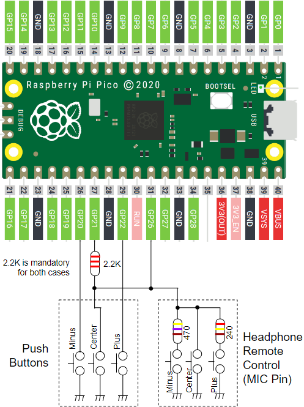

# RPi_Pico_WAV_Player


## Overview
RPi_Pico_WAV_Player is WAV player for Raspberry Pi Pico.

This project features:
* Playback for 44.1KHz 16bit Stereo WAV format 
* SD Card interface (exFAT supported)
* 160x80 LCD interface
* UI Control by 3 GPIO buttons or Headphone Remote Control Buttons
* Display Tag information by LIST chunk in WAV File
* Display Coverart image by JPEG file
* Volume Control Function by fully utilizing 32bit DAC range

## Supported Board and Peripheral Devices
* Raspberry Pi Pico
* ST7735S 0.96" 160x80 LCD
* PCM5102 32bit I2S Audio DAC

## Pin Assignment & Connection
### PCM5102
| Pico Pin # | GPIO | Function | Connection |
----|----|----|----
| 21 | GP16 | BCK | to PCM5102 BCK (13) |
| 22 | GP17 | LRCK | to PCM5102 LRCK (15) |
| 23 | GND | GND | GND |
| 24 | GP18 | SDO | to PCM5102 DIN (14) |

It is recommended that the power of PCM5102 is dedicatedly generated from 5V, not in common using 36 pin 3V3(OUT) of Raspberry Pi Pico.


#### PCM5102 Board Setting
* tie PCM5102 SCK (12) to low (bridge short land)
* H1L (FLT) = L
* H2L (DEMP) = L
* H3L (XSMT) = H
* H4L (FMT) = L

### ST7735S LCD driver
| Pico Pin # | GPIO | Function | Connection |
----|----|----|----
| 12 | GP9 | GPIO | BLK |
| 14 | GP10 | SPI1_SCK | SCL |
| 15 | GP11 | SPI1_TX | SDA |
| 17 | GP13 | SPI1_CSn | CS |
| 18 | GND | GND | GND |
| 19 | GP14 | GPIO | DC |
| 20 | GP15 | GPIO | RES |
| 36 | 3V3(OUT) | 3.3V | VCC |


### SD Card interface
| Pico Pin # | GPIO | Function | Connection |
----|----|----|----
|  4 | GP2 | SPI0_SCK | CLK (5) |
|  5 | GP3 | SPI0_TX | CMD (3) |
|  6 | GP4 | SPI0_RX | DAT0 (7) |
|  7 | GP5 | SPI0_CSn | CD/DAT3 (2) |
|  8 | GND | GND | VSS (6) |
| 36 | 3V3(OUT) | 3.3V | VDD (4) |

#### Caution
* SPI0_TX and SPI0_RX needs to be pull-ed up with 10Kohm.
* Wire length between Pico and SD card is very sensitive. Short wiring as possible is desired, otherwise access errors  will occur.


### Switches
| Pico Pin # | GPIO | Function | Connection |
----|----|----|----
| 26 | GP20 | GPIO | Push Switch (Minus) |
| 27 | GP21 | GPIO | Push Switch (Center) |
| 29 | GP22 | GPIO | Push Switch (Plus) |
| 31 | GP26 | ADC0 | Headphone Remote Control (MIC pin) |



## How to build
* See ["Getting started with Raspberry Pi Pico"](https://datasheets.raspberrypi.org/pico/getting-started-with-pico.pdf)
* Build is confirmed only in Developer Command Prompt for VS 2019 and Visual Studio Code on Windows enviroment
* Put "pico-sdk", "pico-examples", "pico-extras" and "pico-playground" on the same level with this project folder.
```
> git clone -b master https://github.com/raspberrypi/pico-sdk.git
> cd pico-sdk
> git submodule update -i
> cd ..
> git clone -b master https://github.com/raspberrypi/pico-examples.git
> 
> git clone https://github.com/raspberrypi/pico-extras.git
> cd pico-extras
> git submodule update -i
> cd ..
> git clone https://github.com/raspberrypi/pico-playground.git
> 
> git clone -b main https://github.com/elehobica/RPi_Pico_WAV_Player.git
```
* Lanuch "Developer Command Prompt for VS 2019"
```
> cd RPi_Pico_WAV_Player
> mkdir build
> cd build
> cmake -G "NMake Makefiles" ..
> nmake
```
* Put "RPi_Pico_WAV_Player.uf2" on RPI-RP2 drive

## Button Control Guide
Button Control is available with GPIO 3 push switches or 3 button Headphone Remote Control.
For Headphone Remote Control, Connect MIC pin to GP26 of Raspberry Pi Pico.
GP26 also needs to be pulled-up by 2.2Kohm from 3.3V. See schematic for detail.

### FileView Mode
* Up/Down button to go up/down for file selection
* Center 1 click to get into the folder
* Center 1 click to play WAV file (go to Play Mode)
* Center 2 click to go parent folder

### Play Mode
* Up/Down button for volume up/down
* Center 1 click to pause/play
* Center 2 click to stop (go back to FileView Mode)

## Image File Format
### Opening Logo File
* Put "logo.jpg" on root Folder
* File Format: JPEG format (Progressive JPEG not supported)
* [logo.jpg example](resource/logo.jpg)

### Cover Art File
* Put JPEG file on same folder where WAV files are located
* File Format: JPEG format (Progressive JPEG not supported)
